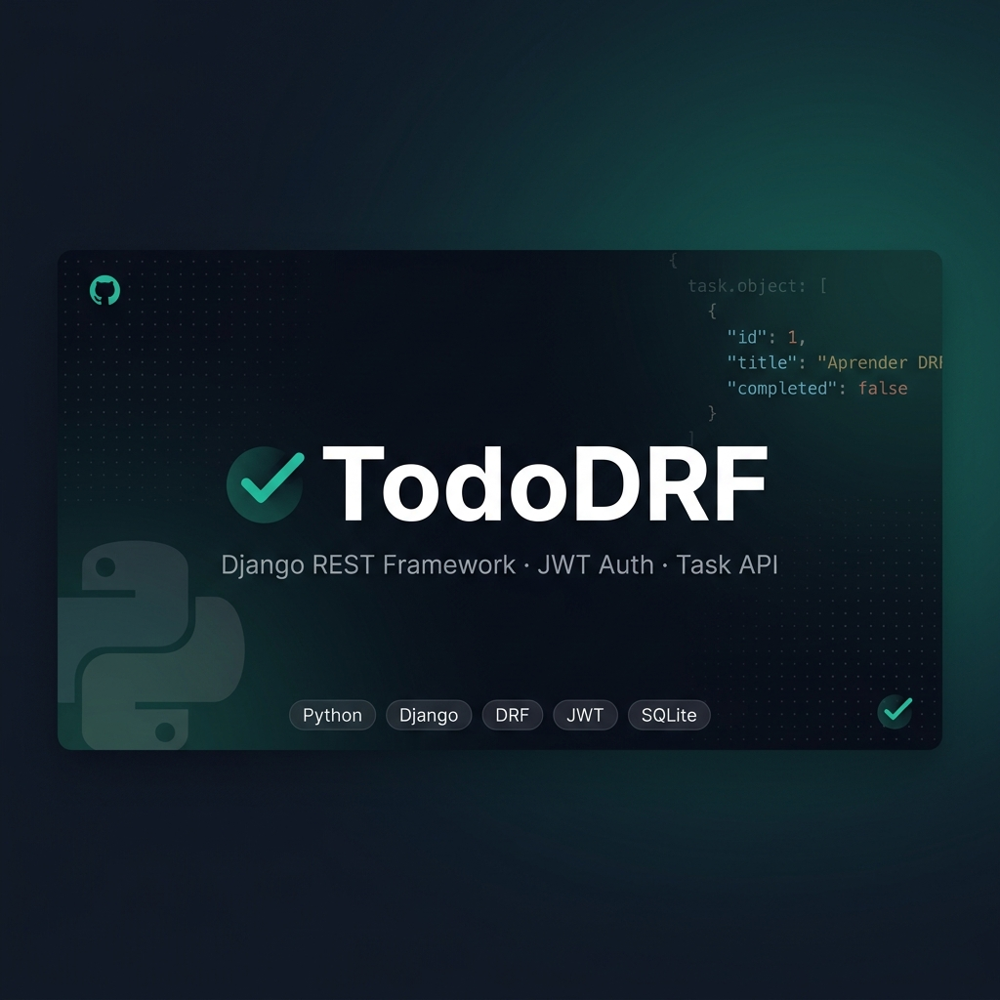

# ✅ TodoDRF



> Una API REST construida con **Django** + **Django REST Framework** para gestionar tareas personales de forma sencilla, segura y ordenada. Sin complicaciones, puro backend. 🚀

---


## 📌 ¿De qué va esto?

**TodoDRF** es una API para un sistema de tareas (TODO list) donde cada usuario puede:

- 📝 Crear sus propias tareas
- 👀 Ver solo las suyas (nada de ver las del vecino)
- ✏️ Editarlas cuando quiera
- 🗑️ Borrarlas sin drama
- 🔍 Filtrarlas por estado (`completed=true` o `completed=false`)
- 📄 Navegar entre páginas si hay muchas tareas

Todo protegido con **JWT** para que solo entren los que tienen que entrar. 🔐

---

## 🛠️ Stack técnico

| Tecnología | Versión / Detalle |
|---|---|
| 🐍 Python | 3.x |
| 🌐 Django | 5.x |
| 🔌 Django REST Framework | última estable |
| 🔑 SimpleJWT | autenticación via tokens |
| 🗄️ Base de datos | SQLite (dev) |

---

## 📂 Estructura del proyecto

```
tododrf/
├── manage.py               # 🎛️ Punto de entrada de Django
├── db.sqlite3              # 🗄️ Base de datos (solo en dev)
│
├── tododrf/                # ⚙️ Configuración global del proyecto
│   ├── settings.py         # Toda la config: apps, DB, JWT, paginación...
│   ├── urls.py             # Rutas raíz
│   └── wsgi.py
│
└── tasks/                  # 📋 App principal
    ├── models.py           # Modelo Task
    ├── serializers.py      # TaskSerializer + RegisterSerializer
    ├── views.py            # TaskViewSet (ModelViewSet)
    ├── urls.py             # Router con las rutas auto-generadas
    ├── permissions.py      # Permiso isOwner (solo el dueño toca su tarea)
    └── admin.py            # Tareas registradas en el admin
```

---

## 🔗 Endpoints disponibles

> Todas las rutas van bajo el prefijo `/api/`

### 🔐 Autenticación

| Método | Ruta | Descripción |
|--------|------|-------------|
| `POST` | `/api/auth/register/` | Registrar nuevo usuario |
| `POST` | `/api/auth/token/` | Obtener tokens JWT (login) |
| `POST` | `/api/auth/token/refresh/` | Refrescar el access token |

### ✅ Tareas

| Método | Ruta | Descripción |
|--------|------|-------------|
| `GET` | `/api/tasks/` | Listar tareas del usuario autenticado |
| `POST` | `/api/tasks/` | Crear una nueva tarea |
| `GET` | `/api/tasks/{id}/` | Ver detalle de una tarea |
| `PUT` | `/api/tasks/{id}/` | Actualizar tarea completa |
| `PATCH` | `/api/tasks/{id}/` | Actualizar tarea parcialmente |
| `DELETE` | `/api/tasks/{id}/` | Eliminar una tarea |

### 🔍 Filtros y Paginación

```
GET /api/tasks/?completed=true     # Solo tareas completadas
GET /api/tasks/?completed=false    # Solo tareas pendientes
GET /api/tasks/?page=2             # Segunda página de resultados
```

---

## 🧩 Modelo de datos

Cada tarea (`Task`) tiene los siguientes campos:

```json
{
  "id": 1,
  "title": "Aprender DRF",
  "description": "intro a drf",
  "completed": false,
  "created_at": "2026-06-29T20:08:11.842905Z",
  "owner": "alexl"
}
```

| Campo | Tipo | Descripción |
|-------|------|-------------|
| `id` | int | Identificador único (auto) |
| `title` | string | Título de la tarea (max 200 chars) |
| `description` | string | Descripción opcional |
| `completed` | boolean | `false` por defecto |
| `created_at` | datetime | Fecha de creación (auto) |
| `owner` | string | Username del dueño (read-only) |

---

## 🚀 Cómo levantar el proyecto

```bash
# 1. Clonar el repo
git clone <url-del-repo>
cd tododrf

# 2. Crear y activar el entorno virtual
python -m venv venv
venv\Scripts\activate      # Windows
# source venv/bin/activate  # Mac/Linux

# 3. Instalar dependencias
pip install -r requirements.txt

# 4. Aplicar migraciones
python manage.py migrate

# 5. Crear superusuario (opcional, para el admin)
python manage.py createsuperuser

# 6. Levantar el servidor
python manage.py runserver
```

> 🌐 La API estará disponible en `http://127.0.0.1:8000/api/`

---

## 🔑 ¿Cómo autenticarse?

**1. Registrar un usuario:**
```bash
POST /api/auth/register/
{
  "username": "tu_usuario",
  "email": "tu@email.com",
  "password": "contraseña123"
}
```

**2. Obtener los tokens:**
```bash
POST /api/auth/token/
{
  "username": "tu_usuario",
  "password": "contraseña123"
}
```

**3. Usar el `access` token en cada request:**
```
Authorization: Bearer <access_token>
```

---

## ⚙️ Configuración clave

```python
REST_FRAMEWORK = {
    'DEFAULT_AUTHENTICATION_CLASSES': (
        'rest_framework_simplejwt.authentication.JWTAuthentication',
    ),
    'DEFAULT_PERMISSION_CLASSES': (
        'rest_framework.permissions.IsAuthenticated',
    ),
    'DEFAULT_PAGINATION_CLASS': 'rest_framework.pagination.PageNumberPagination',
    'PAGE_SIZE': 2   # items por página (ajustable)
}
```

---

## 🔒 Seguridad

- Cada usuario **solo ve y modifica sus propias tareas** gracias al permiso personalizado `isOwner`.
- La autenticación es por **JWT** — sin cookies, sin sesiones.
- `DEBUG = True` solo en desarrollo. En producción hay que cambiarlo. 🚨
- La `SECRET_KEY` debe rotarse antes de llevar esto a producción.

---

